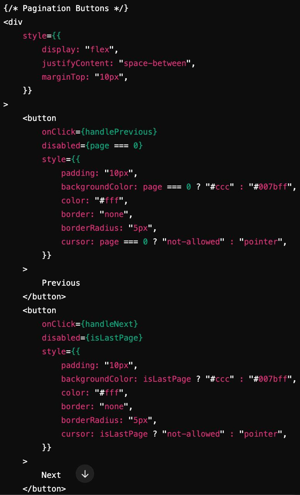
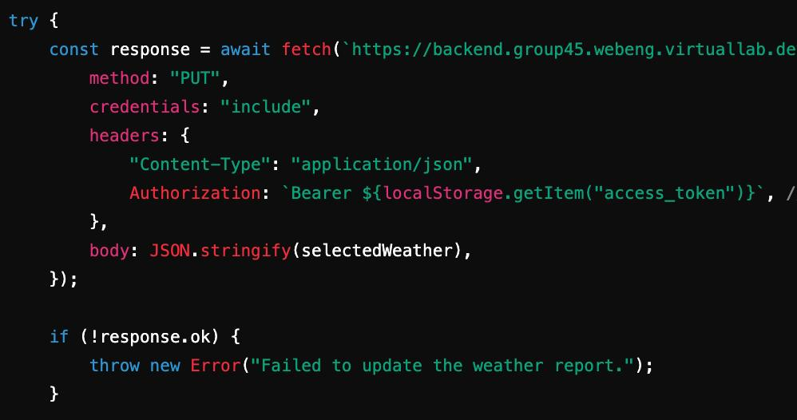
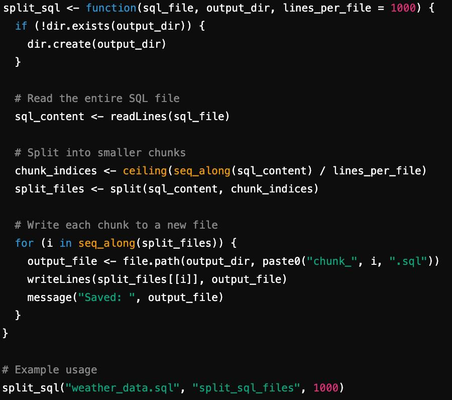
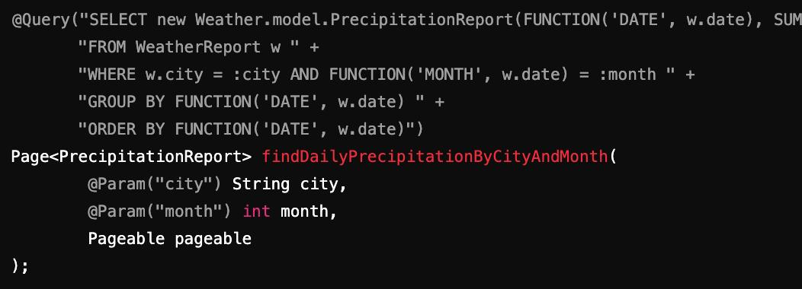
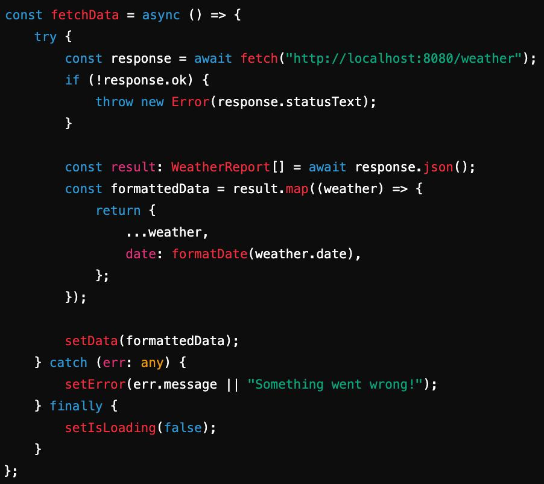

# Report on Weather Reports application
### By Tudor Badici, Andrei Lentu, Sabina Iliuta

## Technologies Used
 ### For the backend we have opted for the use of Java 17. On top of this we have used multiple libraries to help us create a complete application. The libraries we used are:

- Spring Boot
- Lombok: For generating getters, setters, constructors at compile time
- MariaDB: Since it uses SQL for defining, querying, and managing data
- Flyway: Helps with database configuration through things like version control, consistency across environments
- OpenCSV: Library used to write CSV files
- JavaTuples: Provides tuple classes for convenience
- Maven Plugin: 
    * maven-compiler-plugin: Configured to use lombok annotation processor and compile the code to Java
    * spring-boot-maven-plugin: packages the application as a JAR

These libraries have been chosen due to accessibility. By that we mean that we were familiar with most of them and were easy to implement and use effectively.

### As for the frontend we have decided to use Typescript with React. The library used are:
 
- React and React Router: form the core of our UI and client-side routing
- Vite: Build tool and development server
- ESLint: for code quality and consistency in style
- Typescript definitions: type support for the React libraries

We have opted for this configuration because it includes multiple benefits such as: fast build times, robust UI features, code quality checks.

## Application Requirements

### REQ1
1.1: Post, delete, put methods were implemented. Individual get, getAll and filtering by date were coded as well. In the frontend, these are available through the Post and Get buttons, but the DELETE and PUT methods can be done directly from the table "Weather Data List"

1.2: This was done through filtering with a get function. City, year and month are required. Day and hour are not. If hour is left out then array is returned of all hours in that day, if day is left out, data of all days and hours in that month are retrieved. If both day and hour are also present, it only returns one item. On the frontend, omitting the day and hour on the Get page will do what this requirement wants.

1.3: Method asks for city and year. Then returns a Map, mapping the years to a List of doubles, representing its months and their average temperatures. This can be found on the frontend on the Average Temperature page.

1.4: Method asks for city, month, page number and batch size. It then returns the specified page, which has objects of type daily report, which have the sum of precipitation for that day. This is found on the Total Precipitation page on the website

1.5: Two endpoints were made for this requirement. The first one handles the method which returns the top/bottom N temperatures for a specified year. The second endpoint also asks for a number of years, which represents how many years ago the count for the extreme temperatures should start. These are both available through buttons saying Extreme Temperatures.

### REQ2

The GET methods all have the options to display the data in csv, regardless of the object wanted. This is however not implemented on the frontend as 
it is nicer to have our own design of the displayed data. The CSV/JSON choice is done through a request parameter, which decides if the method will return a response
entity with a JSON object encapsulated in it, or a CSV string.

### REQ3

Our open API document shows for each endpoint it's return type and in some cases example, request body, URL parameters and their types and if required or not. Each endpoint also has a positive and negative status quotes.
Endpoints also have return examples.

### REQ4

The documentation mentioned above was followed in order to code our application. At some points we realized that we needed different functionalities or returns from methods, so we changed the documentation to match them. At this point, the API endpoints and the OpenAPI specification are 
strong matches.
Optionally, we also have a persistent Maria DB database which is filled with 1 million entries whenever docker compose up is run.

### REQ5

We implemented the frontend using typescript, react and vite. Every endpoint and functionality in the backend is represented and accessible in some way through the frontend. For example there is a whole page to post new entries, but the edit or delete is done by directly clicking on the report in the table.
In general, the main functionalities are present and clearly outlined on the front page.

### REQ6

We have a Dockerfile, which is for the backend, and the Dockerfile-front for the frontend. These two are connected in the services section of our docker-compose file. 
The database is run first and mounted with data. Then, a health check occurs before the API is started. Lastly the frontend starts as well.
Our group repository was cloned onto the VM. All necessary environment variables are also present on there. The app was tested and it runs perfectly using docker compose up.

### REQ7 & 8

This is the report itself, required sections have been made and highlighted as mentioned in the project description.

## Maturity of the Api

Our API easily clears Level 0 Maturity, as it clearly makes use of HTTP methods as a way of completing transactions between
user and server. At this level, data can be represented in any way, but we have the option between CSV and JSON.

Level 1 enforces that resources have to be identified by URIs, which we do. Now, interactions target specific resources, such as we do 
through our filtering methods using GET, but also the way that our pages are layed out, each being accessible through URLs from the home page.

Level 2 is also respected in our application, requiring the use of HTTP verbs, as well as the generation of status codes. We do both of these not only 
through our endpoints, retrieving data, posting, editing, and manipulating it for the clarity of the user, but we also employ complete and clear
status codes, making use of the concept of self-describing messages.

However, the last level would require the application to provide more links and hypermedia controls, which is not something that we currently have.
This last level is a big step which includes. We have some links binding resources between them, but a full Level 3 API would need every resource
to be accessible from any point, and do it in a simple manner, as users should be able to navigate the application through hypermedia links without
having to know its structure beforehand.

## Group contribution

* Sabina: added Maria DB to the project along with flyway migration configuration
* Andrei: dockerized the application, using a docker compose to start database and then the backend
* Andrei: started working on basic backend operations. Added weather report model, and created basic post, put, delete and get methods 
* Tudor: implemented requirement 1.5 , retrieving top or bottom temperatures from year/years
* Sabina: retrieved average temperature per month
* Andrei: completed the rest of the missing backend functions, except for the 1.4 pagination method
* Sabina: started working on frontend, making the homepage and adding buttons for all the required methods of the backends
* Sabina: connected backend with the frontend by adding a table in the weather data list page, through a get request
* Andrei: implemented the post and get (filtering methods on the frontend)
* Tudor: coded the frontend pages and connected the backend methods for : average temperature and both extreme temperature endpoints
* Andrei: coed the total precipitation endpoint in the backend
* Sabina: coded the first version of the total precipitation page on the frontend, and connected it to backend
* Andrei: cloned the repository onto the ssh server, and made sure it ran
* Tudor: started the report 
* Sabina: used R studio to trim and select appropriate columns and data from the hourly weather data set. Then, reduced it to 1 million lines and split that into 10 separate SQL files to be mounted on the database
* Andrei: changed the docker compose in order to mount the data onto the database. Made small modifications to the SQL queries made by Sabina
* Andrei: changed the way that the getAll method works, implemented pagination, as fronted crashed from too many entries at once
* Andrei: following this idea, changed the total precipitation page, allowing user to flip through the pages
* Tudor: completed the technologies, project requirements and api maturity model analysis
* Sabina: added group contribution, refining requirement explanations and added generative ai usage
* Andrei: completed maturity model assessment, and added back csv option for endpoints. Fixed average temperature endpoint to give data for years since instead of singular year.
## Generative AI usage

We used Chat GPT-4o, the unpaid version

Above is that chatGPT generated to the prompt: "Give me two buttons which can act as previous/next arrows to flip through different pages of data "
This code snippet wa useful for both the pages in total precipitations, as well as the ones in the main weather data list.

The chatGPT prompt above was used to clarify how calling methods other than get should be employed on the frontend, as you can see, a put requires a body which the get does not, and we had not figured out how to do that on our own.

This R script was used to split the 1 million rows of data into other smaller chunks, which made it easier for the data to be mounted on the database.

Above, we asked chatG{T's help in order to think of a complex SQL query which added the precipitations for all hours of a certain day in a certain city.

The prompt above was one of our first inquiries on how to connect backend methods to frontend buttons and values. This way of storing the response of a HTTP method was also employed by us for the majority of other backend method calls. 

